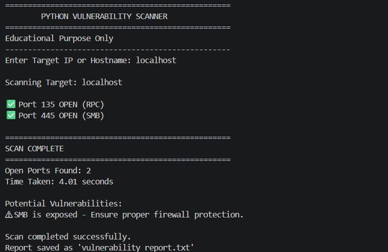

# Python Port Scanner

A simple TCP port scanner built using Python.

## 🚀 Features

- Scan common TCP ports
- Detect open and closed ports
- Display service names
- Measure scan time
- Clean terminal interface

## 🛠 Technologies

- Python
- Socket Module
- Git
- GitHub

## 📷 Sample Output

## 📚 What I Learned

- Socket programming
- TCP ports and services
- Dictionaries
- Loops
- Python networking
- Git and GitHub
